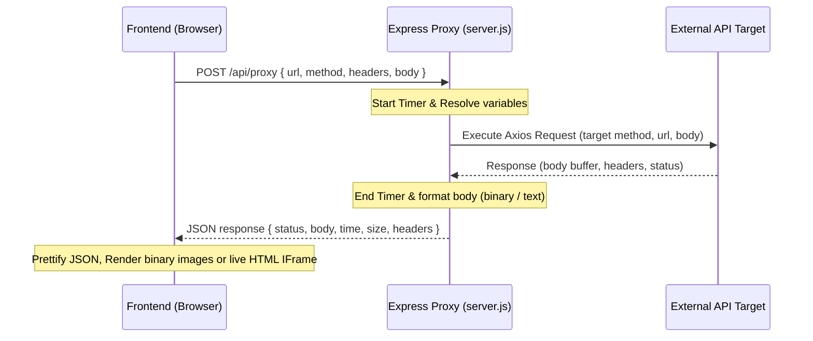

# ThunderPost - Premium Browser-based API Testing Platform

ThunderPost is a lightweight, responsive, and modern browser-based API testing platform built as a high-performance alternative to Postman. Designed to be developer-friendly and installation-free, it empowers developers to compose, dispatch, organize, and reuse API requests directly within the browser. 

To solve browser CORS restrictions, ThunderPost includes a server-side Node.js proxy that forwards HTTP requests (including the new RFC 9435 HTTP `QUERY` method) to target APIs, returns detailed diagnostics (headers, status, cookies, size, latency), and format-prettifies the response payloads.

---

## 🚀 Key Features

1. **HTTP Request Builder & custom `QUERY` Method**:
   - Supports `GET`, `POST`, `PUT`, `PATCH`, `DELETE`, and the new safety-focused HTTP `QUERY` method.
   - Dynamic parameters editor: key-value inputs that automatically parse and synchronize bidirectionally with the URL query string.
   - Custom headers management with common autocomplete helpers.
   - Comprehensive request body types: `None`, `JSON` (with built-in validation), `Raw Text`, `Form Data`, and `x-www-form-urlencoded`.

2. **CORS-Bypass Backend Proxy**:
   - Executes requested actions server-side on Node.js using Axios, bypassing client-side origin checks.
   - Calculates response sizes in bytes/KB and roundtrip request latencies in milliseconds.
   - Handles binary responses (e.g. returns base64 for images to render in the client) and raw text/JSON seamlessly.

3. **Mock Echo Server API**:
   - Houses a built-in mock endpoint `/api/mock` that echoes back request methods, paths, headers, query parameters, cookies, and bodies.
   - Perfect for testing API actions, auth headers, and variables locally.

4. **Authentication Modes**:
   - Supported configurations: `No Auth`, `Bearer Token`, `Basic Auth` (encodes credentials in Base64), and `API Key` (injectable in either Headers or Query Parameters).

5. **Environments & Dynamic Variables**:
   - Configure multiple custom environments (e.g., Development, Staging, Production).
   - Use double curly braces `{{VARIABLE_NAME}}` to inject dynamic variables in URL, params, headers, auth configurations, and body payloads.

6. **Collections Organizer**:
   - Logically group request configurations into collections.
   - Create, rename, delete collections, and save request snapshots to them.
   - Import/Export collections from standard JSON files.

7. **Request History Log**:
   - Automatically records last 40 executed requests.
   - Restores configuration state with a single click.

8. **Response Viewer & HTML Visualizer**:
   - Auto-formats and syntax-highlights JSON outputs (colored keys, strings, booleans, numbers).
   - Shows cookie attributes (`Domain`, `Path`, `Expires`) and response headers.
   - Built-in sandboxed iframe visualizer to preview live HTML outputs directly.

9. **Code Snippet Generator**:
   - Instant conversion of current request builder configuration into copyable client code in:
     - `cURL` command
     - JavaScript `Fetch` API
     - JavaScript `Axios` library
     - Python `requests` library

---

## 🛠️ Technology Stack

- **Frontend**: Vanilla HTML5, CSS3, ES6+ Javascript.
- **Styling**: Modern, premium slate dark-mode theme utilizing pure CSS, flexbox grids, and fluid transitions (zero heavy UI framework dependencies).
- **Icons**: Custom embedded SVG vectors for fast, offline, and lightweight styling.
- **Fonts**: `Inter` for visual typography, `Fira Code` for monospaced code elements.
- **Backend**: Node.js & Express.js.
- **HTTP Client**: Axios (for robust proxying, custom method handling, and binary parsing).

---

## 📂 Folder Structure

```
/post
  ├── public/                    # Frontend Static Assets
  │     ├── index.html           # Main Application Layout
  │     ├── styles.css           # Custom Glassmorphism Dark CSS Stylesheet
  │     └── app.js               # Reactive App Controller State & UI Binding
  ├── server.js                  # Express Proxy and Mock Echo API Server
  ├── package.json               # Node Package Dependencies & Scripts
  ├── test-proxy.js              # Server Integration Test Suite
  └── README.md                  # Comprehensive Documentation
```

---

## ⚙️ Installation & Setup

### Prerequisites

- [Node.js](https://nodejs.org/) (v16.0.0 or higher recommended)
- `npm` package manager

### Steps to Run

1. Clone or navigate to the project directory:
   ```bash
   cd post
   ```

2. Install backend dependencies:
   ```bash
   npm install
   ```

3. Start the application:
   ```bash
   npm start
   ```
   *Alternatively, start with `npm run dev` to launch.*

4. Launch your browser and open:
   ```
   http://localhost:3000
   ```

---

## 🔬 Integration Tests

ThunderPost comes with an automated integration test suite that tests the Express proxy capabilities and mock routes (including `QUERY` verification).

To execute tests:
```bash
node test-proxy.js
```

---

## 🔄 Application Workflow

### CORS Bypass Request Forwarding


### Bidirectional Parameters Synchronization
- **URL to Grid**: Typing query characters in the URL text box triggers a URL parser. It extracts keys/values, updates the parameter state array, and redrafts the key-value input grid rows.
- **Grid to URL**: Adjusting input fields or ticking checkboxes within the params grid rebuilds the parameters search string and updates the main URL path dynamically.
